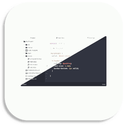

<p float="left">
<a href="../../"></a>
<a href="https://www.codacy.com/manual/FredHappyface/Reference.AtomOneTheme"></a>
<a href="https://www.codacy.com/manual/FredHappyface/Reference.AtomOneTheme"></a>
<a href="../../"></a>
<a href="../../issues"></a>
<a href="/LICENSE.md"></a>
<a href="../../commits/master"></a>
<a href="../../commits/master"></a>
</p>

# Reference.AtomOneTheme



A repository containing and lining to other repositories for the Atom One Theme
Light and Dark Variants for a range of text editors and other applications.

Note that not all of these themes have been tested and this is mainly intended to
simplify the discovery of these themes. If you know of a better alternative or
are having issues feel free to contribute or open an issue.

## Use

(Yes, this list is the same as that for Dracula which is considered to be one of
the most complete themes. The aim is to locate themes for these applications and
hopefully extend this)

### Base16
https://github.com/chriskempson/base16

Follow the link above and find your application. select it from the Template
Repositories section and follow the instructions for the application in
question. This is the easiest option. Alternatively find an application below:

### Code Editors
- Vim \([light, dark](https://github.com/rakr/vim-one),[dark](https://github.com/joshdick/onedark.vim)\)
- Sublime \([light](https://github.com/alfredxing/one),[dark](https://github.com/andresmichel/one-dark-theme)\)
- Xcode \([light](https://github.com/ilyagru/one-dark-light-xcode-theme),[dark](https://github.com/bojan/xcode-one-dark)\)
- Atom \([light](https://atom.io/themes/one-light-ui),[dark](https://atom.io/themes/one-dark-ui)\)
- Visual Studio Code \([light](https://marketplace.visualstudio.com/items?itemName=akamud.vscode-theme-onelight),[dark](https://marketplace.visualstudio.com/items?itemName=zhuangtongfa.Material-theme)\)
- Notepad++ \([dark](https://github.com/60ss/Npp-1-Dark)\)
- Emacs \([light, dark](https://github.com/balajisivaraman/emacs-one-themes),[dark](https://github.com/jonathanchu/atom-one-dark-theme)\)
- JetBrains \([light](https://github.com/cscheng/intellij-one-light-scheme),[dark](https://plugins.jetbrains.com/plugin/11938-one-dark-theme/)\)
- Visual Studio \([dark](https://marketplace.visualstudio.com/items?itemName=adrianwilczynski.one-dark-pro)\)
- Coda \([dark](https://panic.com/coda/plugins.php?id=157)\)
- Brackets \([dark](https://github.com/hikio/brackets-one-dark)\)
- Light Table
- TextMate \([light](https://github.com/chriskempson/base16-textmate/blob/master/Themes/base16-one-light.tmTheme),[dark](https://github.com/digitalpardoe/One-Dark.tmbundle)\)
- Gedit
- Pythonista
- LightPaper
- MonoDevelop \([dark](https://github.com/sunmachine/OneDarkForMono)\)
- Qt Creator \([dark](https://github.com/danieldear/qtcreator_one_dark)\)
- Kate \([dark](/Dark/Kate.kateschema)\)
- BBEdit
### Terminal Emulators
- iTerm \([light](https://github.com/martinlindhe/base16-iterm2/blob/master/itermcolors/base16-one-light.itermcolors),[dark](https://github.com/martinlindhe/base16-iterm2/blob/master/itermcolors/base16-onedark.itermcolors)\)
- Hyper \([light](https://github.com/andrepolischuk/hyper-one-light),[dark](https://github.com/ggamel/hyper-one-dark)\)
- Zsh \([dark](https://github.com/benniemosher/the-one-theme)\)
- Terminal.app
- Mintty \([light](https://github.com/iamthad/base16-mintty/blob/master/mintty/base16-one-light.minttyrc),[dark](https://github.com/iamthad/base16-mintty/blob/master/mintty/base16-onedark.minttyrc)\)
- Mutt
- Konsole \([light](https://store.kde.org/p/1234906/),[dark](https://store.kde.org/p/1216368/), [Base16](https://github.com/cskeeters/base16-konsole)\)
- ConEmu \([light](https://github.com/joonro/ConEmu-Color-Themes/blob/master/themes/one-light.xml),[dark](https://github.com/joonro/ConEmu-Color-Themes/blob/master/themes/one-dark.xml)\)
- Xresources \([light](https://github.com/logico-dev/Xresources-themes/blob/master/light/one-light.Xresources),[dark](https://github.com/logico-dev/Xresources-themes/blob/master/one-dark.Xresources)\)
- PowerShell
### Messaging
- Slack \([dark](https://github.com/benniemosher/the-one-theme)\)
- Telegram \([dark](https://github.com/gilbertw1/telegram-onedark-theme)\)
- Textual
- Quassel
- XChat
### Miscellaneous
- Alfred \([dark](https://github.com/spentacular/alfred-onedark)\)
- GitHub Pages
- Gitk
- GMK
- Sequel Pro \([dark](https://github.com/luis-rodriguez/sequel-pro-one-dark)\)
- React DevTools
- MacDown
- Mindnode
- Nylas N1
- Ulysses \([light, dark](https://styles.ulysses.app/themes/atom-one-MzZ)\)
- Quiver \([dark](https://github.com/pslobo/Quiver-Theme-Atom-One-Dark)\)
- Vivaldi
- Wox


### Plus More
- Firefox \([dark](https://addons.mozilla.org/en-GB/firefox/addon/one-dark-theme/))

## Color Palette

Palette      | Hex       | RGB           | HSL
---          | ---       | ---           | ---
Background   | `#272B33` | `39 43 51`    | `220° 13% 18%`
Comment      | `#5b626f` | `91 98 111`   | `219° 10% 39%`
Current Line | `#2c323d` | `44 50 61`    | `219° 16% 21%`
Foreground   | `#abb2c0` | `171 178 192` | `220° 14% 71%`
Selection    | `#3e4451` | `62 68 81`    | `221° 13% 28%`
Blue 1       | `#61AFEF` | `97 175 239`  | `207° 82% 66%`
Blue 2       | `#65b6f8` | `101 182 248` | `207° 91% 68%`
Cyan 1       | `#56B5C2` | `86 181 194`  | `187° 47% 55%`
Cyan 2       | `#66d7e6` | `102 215 230` | `187° 72% 65%`
Green 1      | `#97C279` | `151 194 121` | `95° 38% 62%`
Green 2      | `#abdc89` | `171 220 137` | `95° 54% 70%`
Orange 1     | `#D19965` | `209 153 101` | `29° 54% 61%`
Orange 2     | `#E4BF7A` | `228 191 122` | `39° 67% 69%`
Purple 1     | `#C578DD` | `197 120 221` | `286° 60% 67%`
Purple 2     | `#d682f0` | `214 130 240` | `286° 79% 73%`
Red 1        | `#DF6B75` | `223 107 117` | `355° 65% 65%`
Red 2        | `#BE5046` | `190 80 70`   | `5° 48% 51%`
Yellow 1     | `#e2c08d` | `226 192 141` | `36° 59% 72%`
Yellow 2     | `#f2ce97` | `242 206 151` | `36° 78% 77%`

## Changelog
See the [CHANGELOG](/CHANGELOG.md) for more information.

## Download
### Clone
#### Using The Command Line
1. Press the Clone or download button in the top right
2. Copy the URL (link)
3. Open the command line and change directory to where you wish to
clone to
4. Type 'git clone' followed by URL in step 2
```bash
$ git clone https://github.com/FredHappyface/Reference.AtomOneTheme
```

More information can be found at
<https://help.github.com/en/articles/cloning-a-repository>

#### Using GitHub Desktop
1. Press the Clone or download button in the top right
2. Click open in desktop
3. Choose the path for where you want and click Clone

More information can be found at
<https://help.github.com/en/desktop/contributing-to-projects/cloning-a-repository-from-github-to-github-desktop>

### Download Zip File

1. Download this GitHub repository
2. Extract the zip archive
3. Copy/ move to the desired location


## Licence
MIT License
Copyright (c) FredHappyface
(See the [LICENSE](/LICENSE.md) for more information.)
